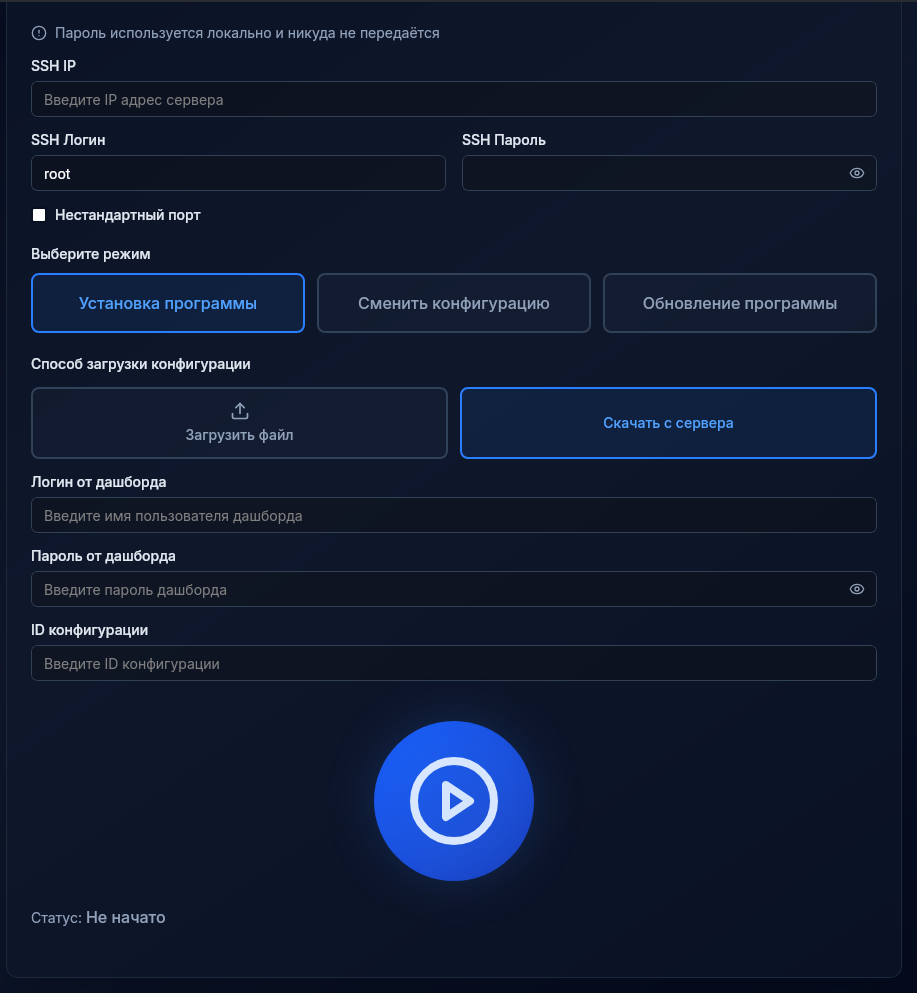
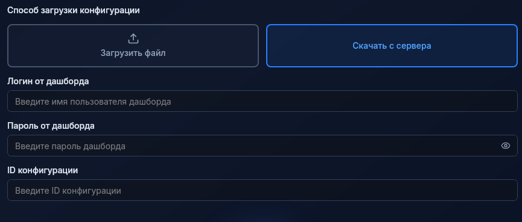
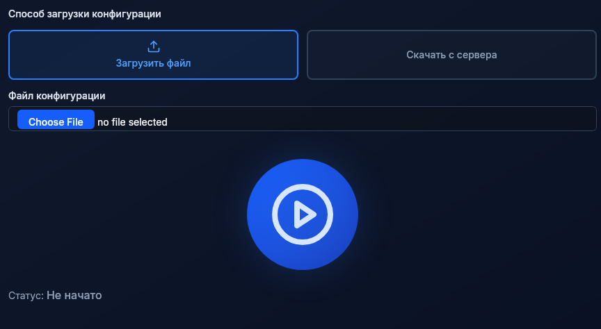
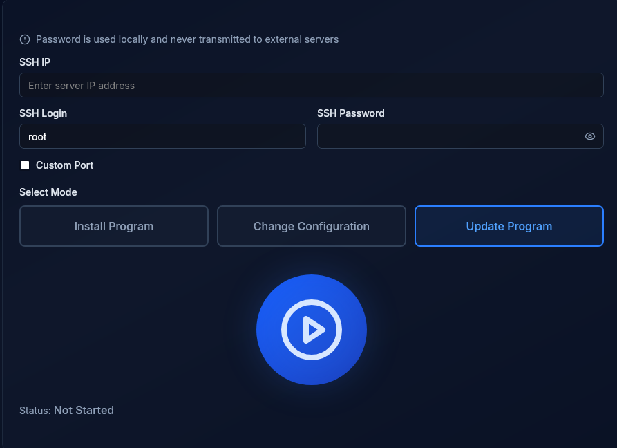

# Инструкция по использованию лаунчера Light Defender

***При возникновении вопросов пишите автору в telegram: @frdlf, или на почту: contact@light-defender.ru***

Перед тем как приступать к представленным далее операциями необходимо получить конфигурацию у @light_defender_bot или создать в dashboard.light-defender.ru

Кроме того, необходимо скачать подходящую версию лаунчера на ПК:
- windows
  - [amd64](https://github.com/fridalif/light-defender-launcher/releases/download/v1.0.0/light-defender-launcher_windows_amd64.exe) *Вероятная версия*
  - [arm64](https://github.com/fridalif/light-defender-launcher/releases/download/v1.0.0/light-defender-launcher_windows_arm64.exe)
- linux
  - [amd64](https://github.com/fridalif/light-defender-launcher/releases/download/v1.0.0/light-defender-launcher_linux_amd64) *Вероятная версия*
- [Все версии](https://github.com/fridalif/light-defender-launcher/releases/)

## Установка Light Defender на удалённый сервер

Чтобы установить Light Defender на удалённый сервер необходимо:
1) Выбрать режим "Установка программы" (или "Install Porgram") и вбить необходимые для подключение по ssh данные

2) Вбить необходимые данные для скачивания конфигурации или загрузить её файлом

3) Нажимаем на большую синюю кнопку и ждём результата

## Обновление версии Light Defender на удалённом сервере

Для обновления версии Light Defender необходмо:
1) Выбрать режим "Обновление программы" (или "Update Program")

2) Вбить данные для подключения по ssh и нажать на большую синюю кнопку

## Смена конфигурации Light Defender на удалённом сервере

Чтобы сменить конфигурацию Light Defender на удалённом сервере необходимо выбрать режим "Сменить конфигурацию" (или "Update Configuration") и следовать тем же шагам как и в пункте *Установка Light Defender на удалённый сервер*

***При возникновении вопросов пишите автору в telegram: @frdlf, или на почту: contact@light-defender.ru***
